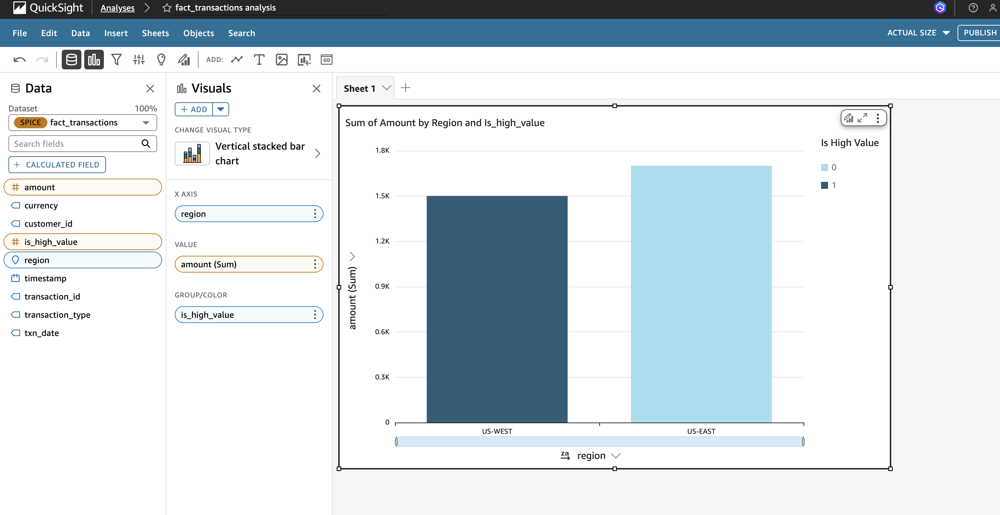

# 🏦 Bank Transactions ETL Pipeline (AWS Project)

This project demonstrates an **end-to-end ETL data pipeline** built on AWS for processing **bank transactions**.  
It covers ingestion, transformation, and storage of raw transaction data into a structured format using AWS services.

---

## 🔧 Architecture & Tools Used

- **Amazon S3** → Data lake with three layers:
  - `raw` → Stores incoming transaction data (CSV files).
  - `staging` → Cleaned and pre-processed data.
  - `curated` → Final transformed dataset ready for analytics.

- **Amazon EMR (Spark)** → Processes raw data, applies ETL transformations, and loads processed data back into S3.

- **IAM** → Secure access control with custom roles for EMR and S3.

- **PySpark** → Transformation logic for parsing transactions, removing duplicates, and aggregating data.

- **Amazon QuickSight** → Business intelligence (BI) tool used to create dashboards and visualize processed transaction data.

---

## 📂 Project Workflow

1. **Data Ingestion**  
   - Upload raw bank transaction files (`transactions.csv`) to the **raw S3 bucket**.  

2. **Processing with EMR**  
   - EMR cluster runs PySpark ETL jobs.  
   - Cleans data (handles nulls, duplicates).  
   - Creates structured datasets (staging → curated).  

3. **Data Storage**  
   - Final cleaned and structured data stored in the **curated bucket**.  
   - Ready for reporting, analytics, or loading into Redshift/Snowflake.

4. **Visualization**  
   - QuickSight connects to curated data and generates interactive dashboards for insights.

---

## 📊 Example Use Case

- Detect failed transactions.  
- Aggregate transactions by **date / account / branch**.  
- Build dashboards (QuickSight / Power BI) for transaction insights.  

---

## 📈 Dashboard Preview  

Here’s a sample QuickSight dashboard built from the curated data:  

---

## 🚀 Future Enhancements
- Add **Kafka / MSK** for real-time transaction streaming.  
- Integrate **AWS Glue Catalog** for schema management.  
- Use **Amazon Redshift** for analytics.  
- Visualize with **Amazon QuickSight**.  

---

## 👨‍💻 Author
**Sreekanth Reddy**  
📧 sreekanthyerramreddy@gmail.com  
🌐 [GitHub Profile](https://github.com/sreekanthreddy32)  
